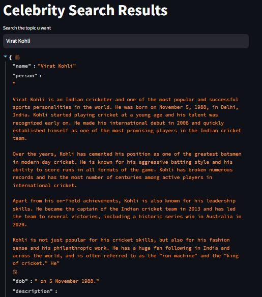

## Dynamic Info Search with Langchain $ Open AI

## Overview  
This project is a dynamic information search tool built using **Langchain**. It allows users to enter a topic, fetch relevant information, and display the results in a structured format using **Streamlit**.

## Features  
- Simple and interactive UI using **Streamlit**  
- Fetches relevant information using **Langchain**  
- Displays structured data in an easy-to-read format  
- User-friendly search functionality  

## Technologies Used  
- **Python**  
- **Langchain**  
- **Streamlit**

## Project Structure  
```
/Dynamic-Info-Search
│── main.py
│── constants.py
│── example.py
│── requirements.txt
│── Celebrity.jpg
│── README.md
```

## Setup & Installation  

1. Clone the repository:  
   ```bash
   git clone <repo-url>
   cd <repo-folder>
   ```

2. Install dependencies:  
   ```bash
   pip install -r requirements.txt
   ```

3. Run the application:  
   ```bash
   streamlit run main.py
   ```

## Usage  
- Enter a search term in the input box.  
- The model will generate relevant details about the topic.  
- View the formatted response on the UI.  

## Project Demo  
  


